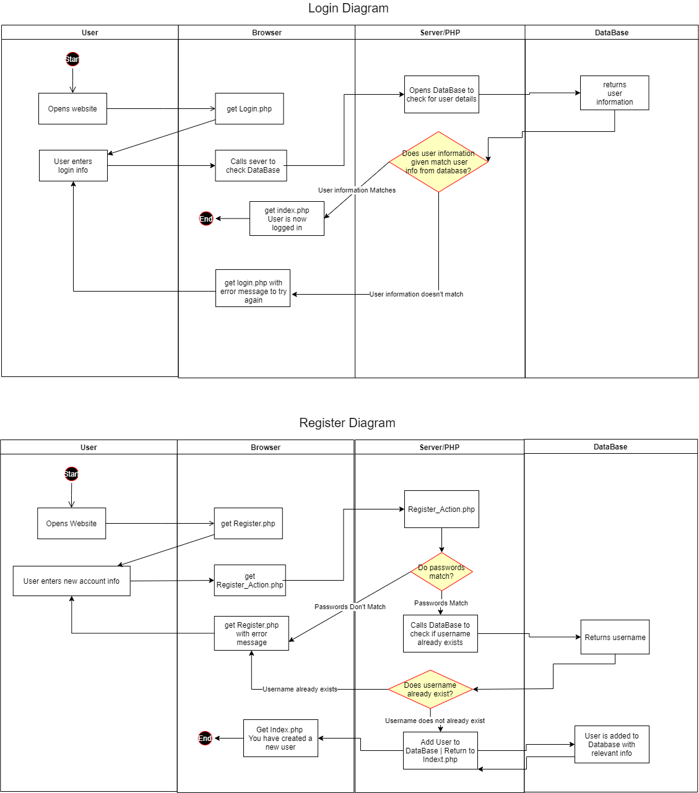
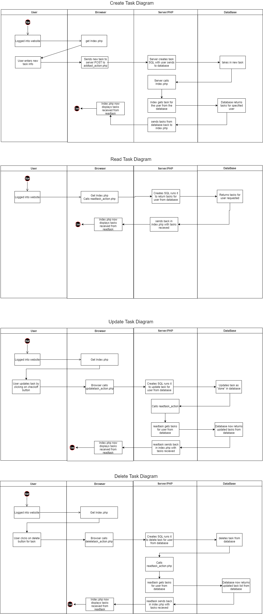
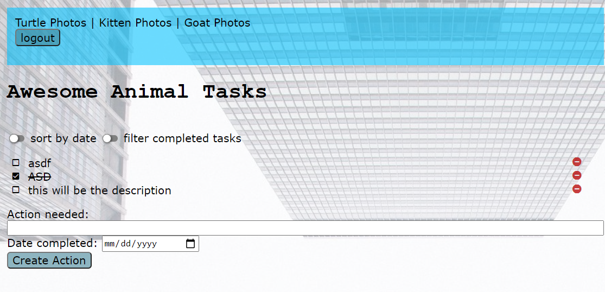
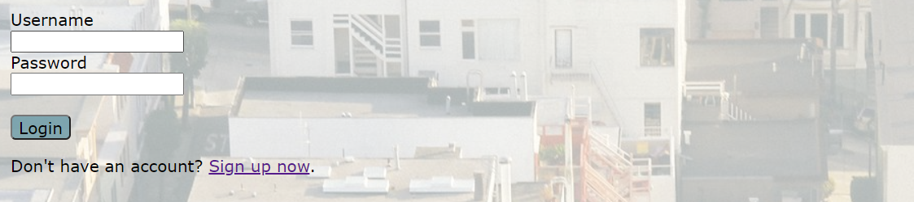
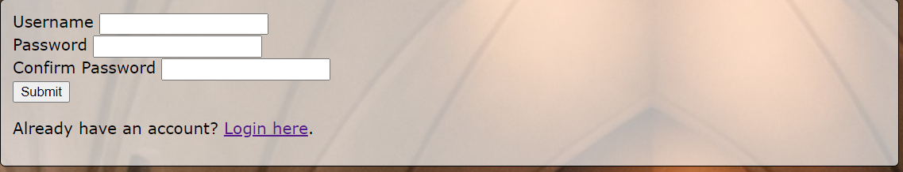

# INTRODUCTION:
### Tayler Bruin  
### 10/11/2021  
### Lab 3 Writeup  
# SUMMARY:
The purpose of this lab was to create a full stack website. The website would allow for users to login, logout and create an account for the site. The website, after logging in, would allow them to create, check off and delete tasks; it would also display any tasks that they have created. This was accomplished using PHP, HTML and MySql to create and query for tasks that need to be displayed and allow users to login, logout and create accounts. 
# DESIGN OVERVIEW:
**index.php:** This is the main page of the website. It houses code to redirect users to login if they have not. This page also displays any tasks and the forms to create tasks if they have already logged in.  
**login.php** This is the login page. It contains the form for the user to login with and a link to the register page. It sends info to login_action.php  
**register.php:** This is the page that contains the register form for people to be able to create accounts. It also contains a link to login if users already have an account. It calls register_action.php for its logic.  
**addtask_action.php:** This houses the logic to be able to add a task. It gets its information from a form in index.php  
**delete_task.php:** This houses the logic to be able to delete a task. It gets its info from a button in index.php  
**login_action.php:** This houses the logic to be able to login to the website. It get its info from a form in login.php  
**logout_action:** This houses the logic to logout a user. It gets its info from the logout button in index.php  
**register_action:** This houses the logic to register new users. It gets its info from a form in register.php  
**updatetask.php:** This houses the logic to update the CSS for a task so that it appears checked off. It gets its info from a button in index.php  
**style.css:** This houses all of the information for the browser to display the site correctly. It makes the site look nice.

Login and register users.

Shows how CRUD functions work for the lab.

This is the main webpage a user sees when logged in with some tasks.

This is the login page for the website.

This is the register page for the website.
# QUESTIONS: 
1. Describe how cookies are used to keep track of the state. (Where are they stored? How does the server distinguish one user from another? What sets the cookie?)  
**Response:** Cookies are stored in a place on the browser called a cookie jar. They are tied to that specific browser and computer. They are name and value pairs. Using these, they can be assigned to a specific user. Cookies are set with PHP. Since all cookies are given an expiration date they are deleted by setting their expiration date to a time in the past. 
2. Describe how prepared statements help protect against SQL injection, but not XSS. 
**Response:**  When statements are prepared, the parameters for the SQL query are created by the form and passed in only as parameters, not as SQL. This means that if someone entered SQL into the user field on the site, and the developer had used prepared statements their site would be protected from this type of attack. The reason they would be protected is because the SQL query is prepared by the developer so, while its values can change, the query itself cannot. Since this only affects the SQL query, it does not help if a user tries to enter code as a variable since that is still treated as valid.
3. Describe at least two key differences between the PHP version of the task list and the JavaScript one you completed in labs 2A and 2B. 
**Response:** The PHP version has the tasks stored on the server. This means that if a user logged into a different computer they would still see their tasks since they are not stored locally. In the JavaScript, you would only be able to pull them up again from the same browser on the same computer. In PHP all of the CRUD functions have their own file that is a separate page called by forms and buttons. In the JavaScript lab all of the functions are stored in one JavaScript file.
4. If we created a new table `login_logout` in the database to keep track of login and logout times of our various users, what would that table's schema look like? Describe necessary fields, which fields would need to be `primary` or `unique`, and what data type you would use for each. 
**Response:** The schema would look something like this.
      | Name      | Type      | Index     | ... | A_I | ... |
      | --------- | --------- | --------- | --- | --- | --- |
      | `id`      | `INT`     | `PRIMARY` | ... | ☒   | ... |
      | `user_id` | `INT`     |           | ... | ☐   | ... |
      | `time`    | `DATETIME`    |           | ... | ☐   | ... |
      | `logged_in`    | `BOOLEAN` |           | ... | ☐   | ... |

# LESSIONS LEARNED:
### READING TASKS FROM A DATABASE
In this lab one of the requirements was to display tasks for a user when they are logged in. The issue with this is that the PHP can only call a different file when an action has occurred on the page, such as a form submission. This means that if you want a task to be accomplished on page load that you have to include all of the code for that task on the page it's loading in. For this lab this means that while your instinct is to create a read_task.php and have that called when your index.php loads is not actually possible. What you have to do is put all of the code that you would have put into read_task.php into index.php and then it will run that code you wanted when the page loads.
### WHEN A CHECKBOX IS NOT REALLY A CHECKBOX
A checkbox is not a valid way to call a php file, but a button is. This means that when you want a user to check a box and have it check off the task and change information about that task in the database, you have to use a button. However, the user will still see a checkbox because using CSS it is possible to make a button look like a check box and just change the image it is displaying to the user when variables are changed. This requires jumping in and out of PHP in order to make everything displays correctly.
### SETTING A USERS ID
When creating a website you want to have all of your users have a unique ID. The initial idea is to create some type of loop in PHP that iterates user IDs so that they are all unique. This is not actually the correct way to do it. What should happen is that when the ID field is created in the database, the developer should make it unique and check auto increment. This way when a new user is created, you don't even have to put in an ID the database will do it for you and keep all of the IDs unique.
# CONCLUSIONS:
- Created a website that users can login, logout and register to.
- Storing users and tasks in server database.
- CRUD functions for tasks assigned to users and stored in a database.
- Using prepared statements to prevent SQL injection attacks.
# REFERENCES:
https://stackoverflow.com/questions/1582161/how-does-a-preparedstatement-avoid-or-prevent-sql-injection  

https://www.w3schools.com/sql/sql_datatypes.asp  

https://www.w3schools.com/php/func_network_header.asp  
